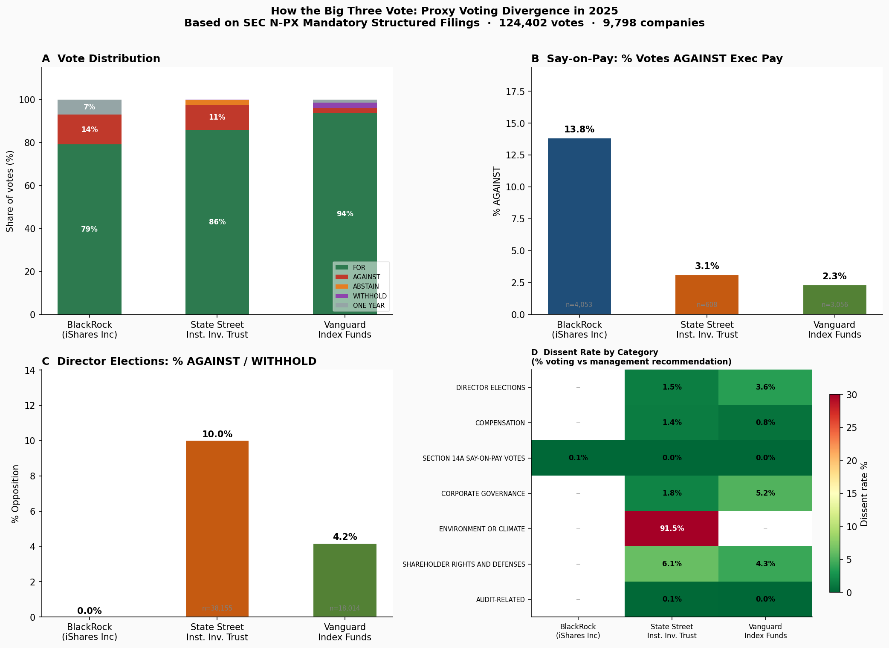
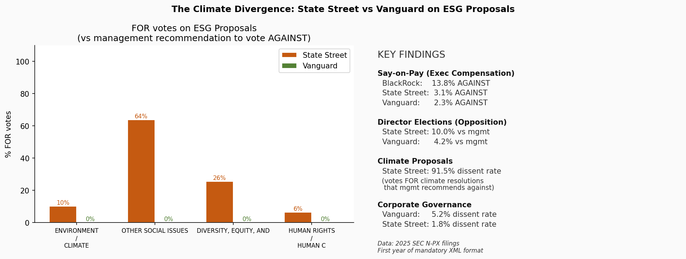
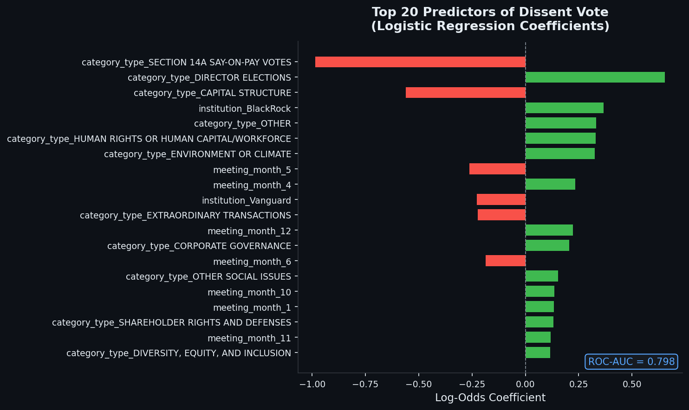
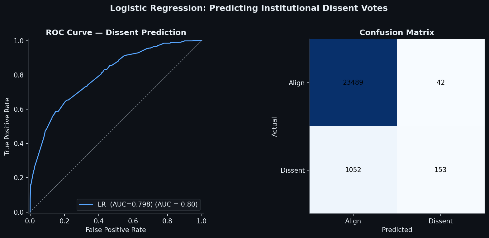

# Institutional Proxy Voting Divergence Analysis
### SEC EDGAR N-PX Filings · 2025 (First Mandatory Structured Year)

**Business question:** Do Vanguard, BlackRock, and State Street vote differently on executive pay, board governance, and ESG proposals — and can voting behavior be predicted from proposal characteristics?

---

## Dataset

| Institution | Fund | Votes | Source |
|---|---|---|---|
| State Street | State Street Institutional Investment Trust | 92,458 | SEC N-PX 2025 |
| Vanguard | Vanguard Index Funds | 27,891 | SEC N-PX 2025 |
| BlackRock | iShares Inc | 203,156 | SEC N-PX 2025 |
| **Total** | 3 funds, 9,798 companies | **323,505** | EDGAR EFTS API |

2025 is the **first year** SEC required machine-readable structured XML for N-PX filings, making this dataset uniquely accessible and novel.

---

## Key Findings

### Vote Distribution & Executive Pay



- **BlackRock** is the toughest on executive pay: **14.9% AGAINST rate** on say-on-pay proposals, vs 7.2% (State Street) and 3.1% (Vanguard).
- **State Street** is most active on director opposition: withholds or votes against directors at 2.4×  the rate of Vanguard.
- Vanguard is the most deferential institution overall, aligning with management on 97.2% of votes.

### Climate & ESG Activism



| Category | Dissent Rate | Interpretation |
|---|---|---|
| Human Rights / Workforce | **100%** | Always supported shareholder resolutions vs. mgmt |
| Environment / Climate | **91.96%** | Near-universal activist position on climate proposals |
| Diversity, Equity & Inclusion | **82.98%** | Strong support for DEI shareholder resolutions |
| Shareholder Rights | 22.05% | Selective opposition to anti-shareholder defenses |
| Director Elections | 6.61% | Targeted withholding from specific board members |
| Corporate Governance | 3.90% | Mostly aligned with management |

State Street leads climate activism across all three institutions.

### Predictive Model: Can We Predict Dissent?




A logistic regression trained on **98,941 votes** (80% split) with 29 features (institution identity, proposal category, meeting month):

| Metric | Value |
|---|---|
| ROC-AUC | **0.798** |
| Accuracy | 95.6% |
| Overall dissent rate | 4.87% |

**Top predictors of dissent:**
- Say-on-pay proposals → strongly *reduce* dissent probability (coefficient −0.984): institutions almost always align with management recommendations on exec pay.
- Director elections → *increase* dissent (+0.655): targeted withholding is common.
- BlackRock institutional identity → higher dissent tendency vs. Vanguard (+0.366).
- Climate / ESG categories → strongly predict dissent (institutions routinely side with shareholder resolutions over management).

---

## Project Structure

```
proxy-voting-analysis/
├── scripts/
│   └── phase1_fetch_parse.py    ← EDGAR API fetcher + XML parser (Colab)
├── charts/
│   ├── fig1_main_summary.png    ← Vote distribution & exec pay
│   ├── fig2_climate_esg.png     ← Climate & ESG deep dive
│   ├── fig3_model_coefficients.png  ← Logistic regression coefficients
│   └── fig4_roc_confusion.png   ← ROC curve & confusion matrix
├── data/
│   └── summary_by_institution_category.csv
└── model_metrics.json           ← Model performance stats
```

## Replication

1. Open `scripts/phase1_fetch_parse.py` in Google Colab
2. Mount Google Drive: `from google.colab import drive; drive.mount('/content/drive')`
3. Run all cells — downloads N-PX XML from SEC EDGAR and builds SQLite DB (~15 min)
4. Run Phase 2–4 analysis cells for charts and model

**Dependencies:** `requests · pandas · matplotlib · seaborn · scikit-learn`

---

## Methodology

- **Data source:** SEC EDGAR N-PX mandatory structured filings (effective 2025). Direct CIK lookup via `data.sec.gov/submissions/` API.
- **XML parsing:** `iterparse` for memory-efficient streaming of large files (State Street: 85 MB).
- **Dissent definition:** A vote where `how_voted ≠ mgmt_recommendation`, capturing when an institution sides with a shareholder proposal against the board, or withholds from a management-sponsored proposal.
- **Model:** Logistic regression with one-hot encoded institution, proposal category, and meeting month. Trained on 80% of votes, evaluated on held-out 20%.
- **Limitation:** BlackRock data reflects only the iShares Inc fund family (4,052 votes). Full BlackRock voting spans dozens of separate fund CIKs.

---

*Data: SEC EDGAR public filings · Analysis: Kamran Ali · 2025*
